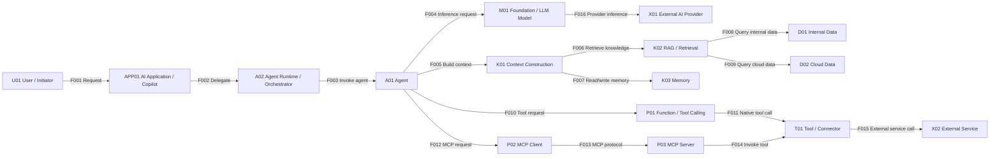

# AI Ecosystem

An open visual reference for understanding the components, interactions, threats, and security controls that make up modern AI systems.

## Project goals

This repository is intended to make the modern AI ecosystem easier to understand visually. It starts with a canonical component and flow taxonomy, then builds multiple views of the ecosystem rather than attempting to force everything into one diagram.

The project is designed to mature through four levels:

1. **Understand** — What are the components?
2. **Visualize** — How do the components interact?
3. **Threat Model** — What can go wrong with each component and interaction?
4. **Secure** — What controls should prevent, detect, or mitigate those threats?

## Design principles

- **One canonical vocabulary.** Component IDs and flow IDs remain stable across every view.
- **Multiple diagrams, one model.** Each diagram focuses on a different architectural concern.
- **Structured data first.** Components and flows live in YAML and can be used to generate diagrams.
- **Mermaid for logical views.** Mermaid diagrams are easy to review and maintain in Git.
- **Draw.IO for detailed visual views.** Presentation-grade and dense security diagrams can be added later.
- **Threats attach to both components and flows.** Security problems often exist at boundaries, not just inside boxes.
- **Controls map to threats.** Later versions should make the threat → control relationship explicit.

## Planned views

| View | Diagram | Purpose |
|---|---|---|
| 01 | AI Ecosystem Overview | 10,000-foot map of the ecosystem |
| 02 | AI Application Architecture | How chat, Copilot-style apps, models, context, tools, and agents fit together |
| 03 | Agentic AI Architecture | Observe → reason → act → observe loops and multi-agent coordination |
| 04 | AI Integration & MCP | APIs, function calling, MCP clients, MCP servers, tools, and external services |
| 05 | AI Data & Knowledge | Enterprise data, cloud data, RAG, embeddings, vector stores, memory, and context construction |
| 06 | AI Model Architecture | Foundation models, LLMs, multimodal models, embedding models, gateways, and providers |
| 07 | AI Identity & Access | Human identity, workload identity, delegated access, secrets, tokens, and tool permissions |
| 08 | AI Development & Supply Chain | Training data, fine-tuning, evaluation, registries, deployment, and dependency provenance |
| 09 | AI Security Controls | Security control overlay across the ecosystem |
| 10 | AI Threat Model | Threat overlay across components, flows, and trust boundaries |

## First logical view



## Repository layout

```text
ai-ecosystem/
├── data/
│   ├── components.yaml
│   ├── flows.yaml
│   ├── views.yaml
│   ├── threats.yaml
│   └── controls.yaml
├── diagrams/
├── docs/
├── schemas/
├── scripts/
└── README.md
```

## Generating Mermaid diagrams

Install PyYAML:

```bash
python3 -m pip install -r requirements.txt
```

Generate all logical Mermaid views:

```bash
python3 scripts/generate_mermaid.py
```

Validate IDs and references:

```bash
python3 scripts/validate_model.py
```

## Status

This is an initial draft. The component taxonomy is intentionally small enough to review before expanding into detailed threat and control mappings.

## License

No license has been selected yet. See `LICENSE-NOT-SELECTED.md`.
